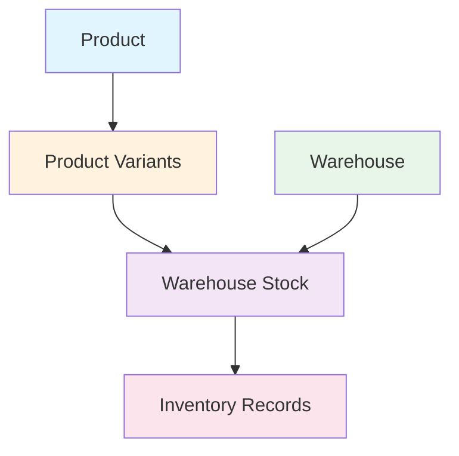

# Warehouse Manager & Product Integration Guide

## Overview

The Warehouse Manager system manages inventory across multiple warehouses and connects products to their stock levels. This document explains the complete flow from product creation to warehouse stock management.

## System Architecture

### Core Concepts



### Database Relationships

```
products (Main Product Table)
├── id (UUID)
├── name
├── description
├── image
├── category_id
└── ... other fields

    ↓ (one-to-many)

product_variants (Product Variations)
├── id (UUID)
├── product_id (FK → products.id)
├── title (e.g., "500g", "1kg", "Red", "Blue")
├── sku
├── price
├── old_price
└── discount_percentage

    ↓ (one-to-many)

inventory (Variant Stock in Warehouses)
├── id (UUID)
├── variant_id (FK → product_variants.id)
├── warehouse_id (FK → warehouses.id)
├── stock_qty
├── reserved_qty
└── bulk_stock_threshold

warehouses (Warehouse Master)
├── id (Integer)
├── name
├── type (zonal/division)
├── location
├── parent_warehouse_id
└── is_active
```

## How Products Connect to Warehouses

### 1. Product Creation Flow

```
Step 1: Create Product
┌─────────────────────────────────────┐
│ Admin creates product with:         │
│ - Name: "Rice Premium"              │
│ - Category: "Groceries"             │
│ - Description: "High quality rice"  │
│ - Base Price: ₹500                  │
└─────────────────────────────────────┘
            ↓
Step 2: Add Variants
┌─────────────────────────────────────┐
│ Admin adds variants:                │
│ - Variant 1: "1kg" - ₹500          │
│ - Variant 2: "5kg" - ₹2400         │
│ - Variant 3: "10kg" - ₹4500        │
└─────────────────────────────────────┘
            ↓
Step 3: Assign to Warehouses
┌─────────────────────────────────────┐
│ Admin assigns stock to warehouses:  │
│ - Delhi Warehouse: 100 units (1kg)  │
│ - Mumbai Warehouse: 50 units (5kg)  │
│ - Bangalore WH: 75 units (10kg)     │
└─────────────────────────────────────┘
```

### 2. Stock Assignment Methods

#### Method A: During Product Creation
When creating a product in the admin panel, you can assign initial stock:

```javascript
// In WarehouseManagement.jsx
const handleProductSubmit = async () => {
  // Create product first
  const product = await createProduct({
    name: "Rice Premium",
    category_id: "cat-123",
    // ... other fields
  });

  // Then assign to warehouses
  for (const warehouse of selectedWarehouses) {
    await addProductToWarehouse(
      warehouse.id,
      product.id,
      variant.id,
      initialStock, // e.g., 100
      minimumThreshold, // e.g., 10
      costPerUnit // e.g., 450
    );
  }
};
```

#### Method B: Via Inventory Management Page
After product exists, manage stock through Inventory Management:

```javascript
// Navigate to: /warehouses/inventory
// 1. Select warehouse from dropdown
// 2. Click "Add Stock"
// 3. Fill form:
{
  product_id: "prod-123",
  variant_id: "var-456", // optional
  stock_quantity: 100,
  minimum_threshold: 10,
  cost_per_unit: 450
}
```

#### Method C: Bulk CSV Upload
Upload multiple stock records at once:

```csv
product_id,variant_id,stock_quantity,minimum_threshold
prod-1,var-1,100,10
prod-1,var-2,50,5
prod-2,var-3,200,20
```

## Warehouse Types & Stock Flow

### Zonal Warehouse (Regional Distribution)

```
ZONAL WAREHOUSE: "North India Hub"
├── Type: zonal
├── Coverage: Multiple states
├── Delivery: 3-4 days
├── Purpose: Regional distribution center
│
├── Stock Example:
│   ├── Rice Premium 1kg: 1000 units
│   ├── Rice Premium 5kg: 500 units
│   └── Rice Premium 10kg: 300 units
│
└── Serves Division Warehouses:
    ├── Delhi Division
    ├── Chandigarh Division
    └── Jaipur Division
```

### Division Warehouse (Local Fulfillment)

```
DIVISION WAREHOUSE: "Delhi Central"
├── Type: division
├── Parent: North India Hub (zonal)
├── Coverage: Specific pincodes (110001-110096)
├── Delivery: 1 day (fast)
├── Purpose: Last-mile fulfillment
│
├── Stock Example:
│   ├── Rice Premium 1kg: 200 units
│   ├── Rice Premium 5kg: 100 units
│   └── Rice Premium 10kg: 50 units
│
└── Pincodes Served:
    ├── 110001 - Delhi (1 day)
    ├── 110002 - Delhi (1 day)
    └── ... (more pincodes)
```

## Stock Allocation Workflow

### Scenario: Allocating Stock from Division to Zonal

```
BEFORE ALLOCATION:
┌─────────────────────────────────────┐
│ Division Warehouse: "Delhi Central" │
│ Rice Premium 1kg: 500 units         │
└─────────────────────────────────────┘

ALLOCATION REQUEST:
Admin allocates 500 units to 3 zonal warehouses:
- North Hub: 200 units
- South Hub: 150 units
- East Hub: 150 units

API CALL:
POST /api/inventory/warehouse/delhi-central/allocate-to-zonal
{
  "product_id": "prod-rice-premium",
  "variant_id": "var-1kg",
  "zonal_allocations": [
    { "zonal_warehouse_id": "north-hub", "quantity": 200 },
    { "zonal_warehouse_id": "south-hub", "quantity": 150 },
    { "zonal_warehouse_id": "east-hub", "quantity": 150 }
  ]
}

AFTER ALLOCATION:
┌─────────────────────────────────────┐
│ North Hub: +200 units (now 200)     │
│ South Hub: +150 units (now 150)     │
│ East Hub: +150 units (now 150)      │
└─────────────────────────────────────┘
```

## Product-Warehouse Connection Points

### 1. Product Page → Warehouse Assignment

**Location**: `/products` or `/warehouse-management`

**Flow**:
```
1. Admin creates/edits product
2. Selects "Warehouse Assignments" tab
3. Chooses warehouses and stock quantities
4. System creates inventory records
```

**Backend**:
```javascript
// warehouseController.js
export const addProductToWarehouse = async (req, res) => {
  const { warehouseId } = req.params;
  const { product_id, variant_id, stock_quantity } = req.body;
  
  // Create inventory record
  await prisma.inventory.upsert({
    where: {
      variant_id_warehouse_id: {
        variant_id,
        warehouse_id: warehouseId
      }
    },
    update: { stock_qty: stock_quantity },
    create: {
      variant_id,
      warehouse_id: warehouseId,
      stock_qty: stock_quantity,
      reserved_qty: 0
    }
  });
};
```

### 2. Inventory Management → Stock Updates

**Location**: `/warehouses/inventory`

**Flow**:
```
1. Admin selects warehouse
2. Views all products in that warehouse
3. Can add/edit/delete stock records
4. Analytics update in real-time
```

**Backend**:
```javascript
// inventoryManagementController.js
export const updateWarehouseStock = async (req, res) => {
  const { warehouseId } = req.params;
  const { product_id, variant_id, stock_quantity } = req.body;
  
  // Update stock using DAO
  await ProductWarehouseStockDAO.upsertVariantStock(
    product_id,
    variant_id,
    warehouseId,
    { stock_quantity, last_restocked_at: new Date() }
  );
};
```

### 3. Order Fulfillment → Stock Deduction

**When customer places order**:
```
1. Customer adds "Rice Premium 1kg" to cart
2. Enters delivery pincode: 110001
3. System finds nearest warehouse serving 110001
4. Checks stock availability
5. Reserves stock (reserved_qty++)
6. On order confirmation: stock_qty--
```

**Backend Logic**:
```javascript
// Order processing
const warehouse = await findWarehouseForPincode(pincode);
const stock = await getVariantStock(variant_id, warehouse.id);

if (stock.stock_qty - stock.reserved_qty >= quantity) {
  // Reserve stock
  await updateStock({
    reserved_qty: stock.reserved_qty + quantity
  });
  
  // On payment success
  await updateStock({
    stock_qty: stock.stock_qty - quantity,
    reserved_qty: stock.reserved_qty - quantity
  });
}
```

## Inventory Analytics

### How Analytics Are Calculated

```javascript
// inventoryManagementController.js
export const getInventoryAnalytics = async (req, res) => {
  const { warehouseId } = req.params;
  
  const inventory = await prisma.inventory.findMany({
    where: { warehouse_id: warehouseId },
    include: {
      variant: {
        include: {
          product: {
            include: { category: true }
          }
        }
      }
    }
  });
  
  const analytics = {
    // Total stock across all products
    total_stock_items: inventory.reduce(
      (sum, item) => sum + item.stock_qty, 
      0
    ),
    
    // Total reserved (in pending orders)
    total_reserved: inventory.reduce(
      (sum, item) => sum + item.reserved_qty, 
      0
    ),
    
    // Available for sale
    total_available: inventory.reduce(
      (sum, item) => sum + (item.stock_qty - item.reserved_qty), 
      0
    ),
    
    // Inventory value (cost-based)
    inventory_value: inventory.reduce(
      (sum, item) => sum + (item.stock_qty * item.cost_per_unit), 
      0
    ),
    
    // Low stock count
    low_stock_count: inventory.filter(
      item => item.stock_qty <= item.bulk_stock_threshold
    ).length,
    
    // By category breakdown
    by_category: groupByCategory(inventory)
  };
  
  return analytics;
};
```

## Complete User Journey

### Admin Journey: Adding Product with Warehouse Stock

```
Step 1: Create Product
├── Navigate to /products
├── Click "Add Product"
├── Fill product details:
│   ├── Name: "Premium Basmati Rice"
│   ├── Category: "Groceries"
│   ├── Description: "Aged basmati rice"
│   └── Upload images
└── Save product

Step 2: Add Variants
├── In product form, go to "Variants" section
├── Add variant 1:
│   ├── Title: "1kg Pack"
│   ├── SKU: "RICE-1KG"
│   ├── Price: ₹500
│   └── Old Price: ₹600
├── Add variant 2:
│   ├── Title: "5kg Pack"
│   ├── SKU: "RICE-5KG"
│   ├── Price: ₹2400
│   └── Old Price: ₹2800
└── Save variants

Step 3: Assign to Warehouses (Option A: During Creation)
├── In product form, go to "Warehouse Assignments"
├── Select warehouses:
│   ├── Delhi Central (Division)
│   ├── Mumbai Hub (Zonal)
│   └── Bangalore Center (Division)
├── For each warehouse-variant combination:
│   ├── Delhi Central + 1kg: 100 units
│   ├── Delhi Central + 5kg: 50 units
│   ├── Mumbai Hub + 1kg: 200 units
│   └── ... (more combinations)
└── Save assignments

OR

Step 3: Assign via Inventory Management (Option B: After Creation)
├── Navigate to /warehouses/inventory
├── Select warehouse: "Delhi Central"
├── Click "Add Stock"
├── Fill form:
│   ├── Product: "Premium Basmati Rice"
│   ├── Variant: "1kg Pack"
│   ├── Stock Quantity: 100
│   ├── Minimum Threshold: 10
│   └── Cost per Unit: ₹450
└── Submit

Step 4: Monitor Stock
├── View analytics dashboard
├── Check low stock alerts
├── Allocate stock between warehouses
└── Generate reports
```

### Customer Journey: How Warehouse Affects Order

```
Step 1: Customer Browses Product
├── Sees "Premium Basmati Rice 1kg"
├── Price: ₹500
└── Clicks "Add to Cart"

Step 2: Enter Delivery Pincode
├── Customer enters: 110001
├── System checks:
│   ├── Which warehouses serve 110001?
│   ├── Found: Delhi Central (Division)
│   ├── Delivery time: 1 day
│   └── Stock available: 100 units
└── Shows: "Delivery in 1 day"

Step 3: Place Order
├── Customer confirms order
├── System reserves stock:
│   ├── Delhi Central
│   ├── Rice 1kg
│   ├── stock_qty: 100 (unchanged)
│   └── reserved_qty: 0 → 1
└── Order status: "Processing"

Step 4: Payment Confirmation
├── Payment successful
├── System deducts stock:
│   ├── stock_qty: 100 → 99
│   └── reserved_qty: 1 → 0
└── Order status: "Confirmed"

Step 5: Fulfillment
├── Warehouse picks item
├── Ships to customer
└── Delivery in 1 day
```

## API Integration Examples

### Get Product Inventory Across All Warehouses

```bash
GET /api/inventory/product/{productId}/warehouses

Response:
{
  "success": true,
  "product": {
    "id": "prod-rice",
    "name": "Premium Basmati Rice",
    "variants": [
      { "id": "var-1kg", "title": "1kg", "price": 500 },
      { "id": "var-5kg", "title": "5kg", "price": 2400 }
    ]
  },
  "inventory_summary": {
    "total_stock": 500,
    "total_reserved": 10,
    "warehouses_count": 3
  },
  "inventory_by_warehouse_type": {
    "zonal": [
      {
        "warehouse": { "id": 1, "name": "Mumbai Hub" },
        "variant": { "id": "var-1kg", "title": "1kg" },
        "stock_qty": 200,
        "reserved_qty": 5
      }
    ],
    "division": [
      {
        "warehouse": { "id": 2, "name": "Delhi Central" },
        "variant": { "id": "var-1kg", "title": "1kg" },
        "stock_qty": 100,
        "reserved_qty": 2
      }
    ]
  }
}
```

### Update Stock for Product in Warehouse

```bash
POST /api/inventory/warehouse/{warehouseId}/update-stock
Content-Type: application/json
Authorization: Bearer {token}

{
  "product_id": "prod-rice",
  "variant_id": "var-1kg",
  "stock_quantity": 150,
  "minimum_threshold": 10,
  "cost_per_unit": 450
}

Response:
{
  "success": true,
  "message": "Stock updated successfully",
  "data": {
    "id": "stock-123",
    "product_id": "prod-rice",
    "variant_id": "var-1kg",
    "warehouse_id": 2,
    "stock_quantity": 150,
    "minimum_threshold": 10
  }
}
```

## Best Practices

### 1. Stock Management
- ✅ Always set minimum thresholds for low stock alerts
- ✅ Use division warehouses for fast delivery areas
- ✅ Use zonal warehouses for broader coverage
- ✅ Monitor analytics regularly
- ✅ Use bulk upload for initial stock setup

### 2. Product-Warehouse Assignment
- ✅ Assign products to warehouses based on demand
- ✅ Keep high-demand products in division warehouses
- ✅ Use zonal warehouses as backup stock
- ✅ Regularly rebalance stock between warehouses

### 3. Inventory Accuracy
- ✅ Reconcile physical stock with system stock monthly
- ✅ Track stock movements with audit logs
- ✅ Use reserved quantity to prevent overselling
- ✅ Set realistic minimum thresholds

## Troubleshooting

### Product Not Showing in Warehouse
**Problem**: Product exists but not visible in warehouse inventory

**Solution**:
1. Check if product has variants
2. Verify stock has been assigned to warehouse
3. Check `inventory` table for records
4. Ensure `is_active` is true

### Stock Not Deducting on Orders
**Problem**: Orders placed but stock quantity unchanged

**Solution**:
1. Check order fulfillment logic
2. Verify warehouse selection for pincode
3. Check stock reservation logic
4. Review order processing flow

### Analytics Showing Wrong Values
**Problem**: Dashboard shows incorrect totals

**Solution**:
1. Refresh the page
2. Check database for orphaned records
3. Verify calculation logic in controller
4. Check for duplicate inventory records

## Summary

The Warehouse Manager system provides complete control over product inventory across multiple warehouses:

1. **Products** are created with variants
2. **Variants** are assigned to warehouses with stock quantities
3. **Warehouses** (zonal/division) serve different geographic areas
4. **Inventory** tracks stock levels per variant per warehouse
5. **Orders** deduct stock from the nearest warehouse
6. **Analytics** provide real-time insights into stock levels

This integrated system ensures efficient inventory management, accurate stock tracking, and optimal order fulfillment.
