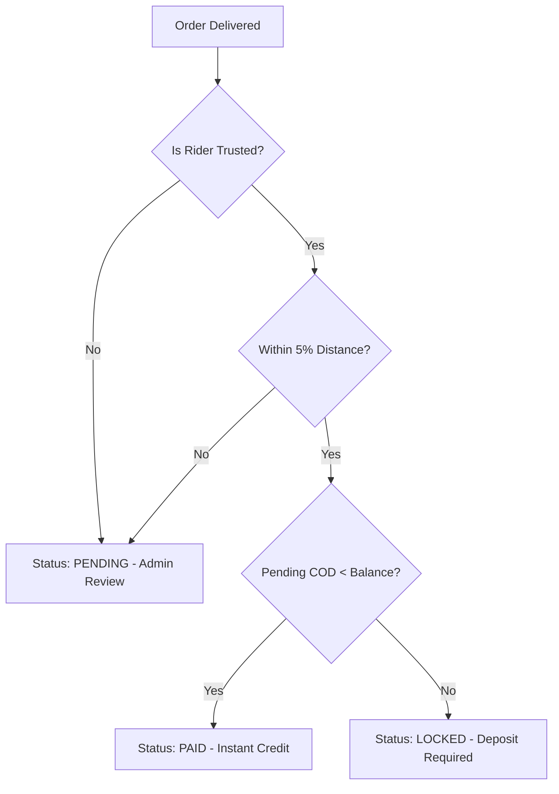
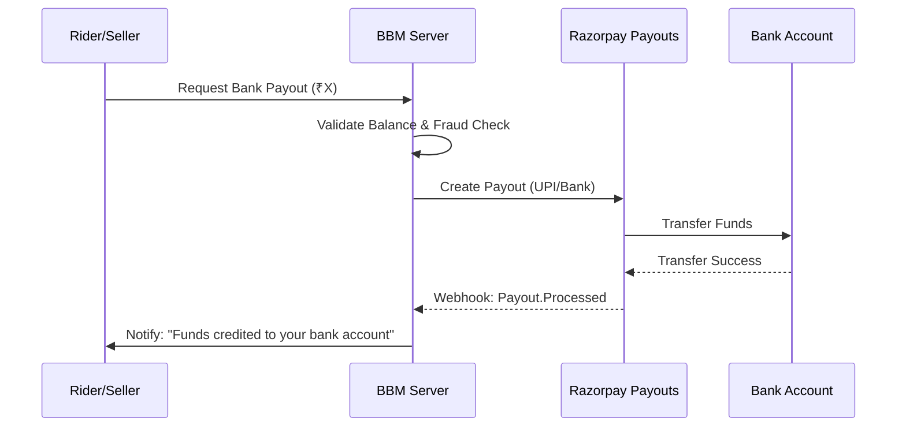

# Automated Payout Flow (Proposed "Phase 3")

This document outlines the proposed transition from a manually-approved payout system to a **Trust-Based Automated Payout System**.

---

## 1. Rider Trust Tiers

To reduce administrative burden, riders are categorized into tiers based on their performance and reliability.

| Tier | Criteria | Payout Logic |
| :--- | :--- | :--- |
| **Standard** | New riders or <95% success rate | **Manual**: Admin must review and approve every payout. |
| **Trusted** | >50 deliveries AND >95% success rate | **Automated**: Payout is credited to wallet instantly upon delivery. |
| **Elite** | >500 deliveries AND >98% success rate | **Priority**: Instant wallet credit + Reduced platform fees. |

---

## 2. Dynamic COD Liability Caps

A primary risk in automated payouts is COD (Cash on Delivery) collection. The new system implements a **Safety Cap** to protect company funds.

### 2.1 The Liability Rule
The system constantly monitors the `Total Pending COD` a rider holds.
- **Rule**: If `Sum(Pending COD) > (Current Wallet Balance + Expected Payout)`, the payout is **Auto-Locked**.
- **Action**: The rider receives a push notification: *"Your payout is paused. Please deposit collected cash to resume instant earnings."*

---

## 3. Auto-Approval Logic

Even for Standard riders, the system can automate the "Verification" step using distance-matching logic.

### 3.1 Margin of Error Check
When a payout is calculated:
1.  System calculates `Estimated Distance` (Leg 1 + Leg 2) at order acceptance.
2.  System calculates `Actual Distance` at delivery.
3.  **Auto-Approve**: If `Actual Distance` is within **±5%** of `Estimated Distance`, the payout is set to `PAID` automatically.
4.  **Manual Review**: If the variance is >5%, the payout is flagged for `MANUAL_REVIEW`.

---

## 4. Bank-Direct Settlement (Roadmap)

The current system relies on a virtual wallet. The new flow proposes an optional **Direct Bank Transfer** for riders and sellers.

### 4.1 Razorpay Payouts Integration
- Users register their **UPI ID** or **Bank Account** in the app.
- Upon reaching a minimum threshold (e.g., ₹500), the system triggers the `Razorpay Payouts API`.
- **Status Mapping**:
    - `Wallet Balance` → `Razorpay Payouts API` → `Bank Account`.

---

## 5. Visualizing the New Flow

### 5.1 Automated Decision Tree

### 5.2 Razorpay Payout Sequence

---

## 6. Implementation Prerequisites
- [ ] Implement `RiderStatsDAO` to calculate success rates and delivery counts.
- [ ] Add `payout_settings` table to store trust tier thresholds.
- [ ] Integrate Razorpay Payouts SDK and configure webhooks for real-time status updates.
- [ ] Update `riderOrderController.js` to trigger the auto-approval check on delivery.
