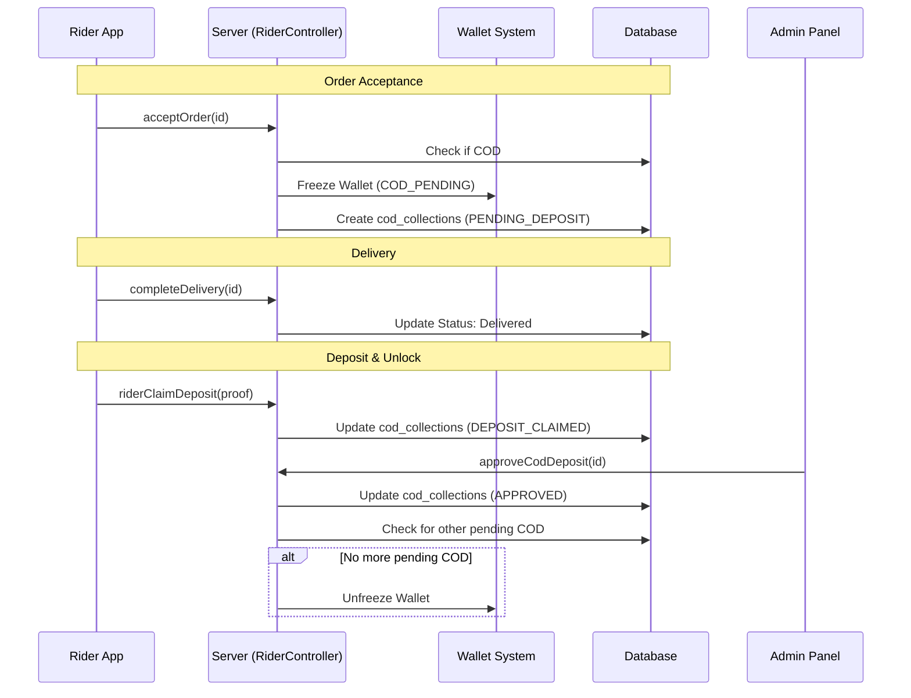
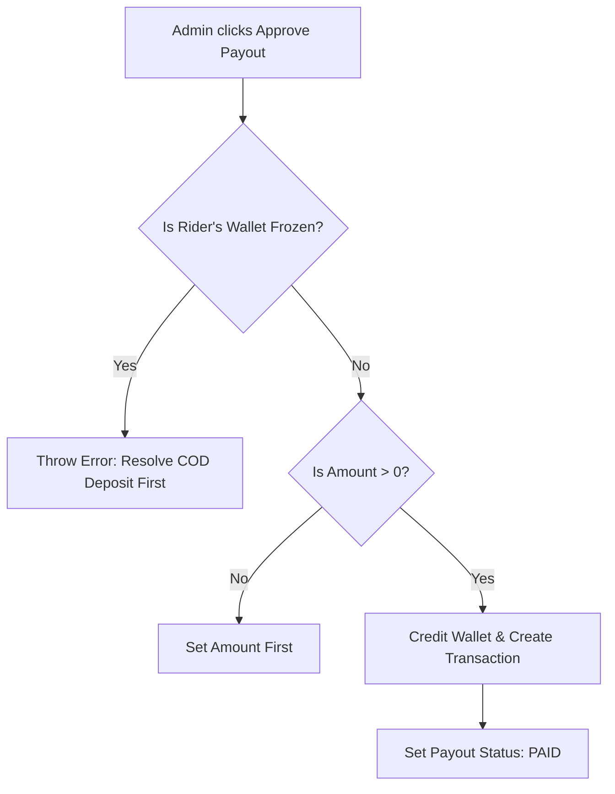

# COD Flow & Payout Locking System

This document explains the technical and financial lifecycle of Cash on Delivery (COD) orders, detailing how cash moves from customers to the company and how the system ensures financial security through the **Payout Locking Mechanism**.

---

## 1. COD Order Lifecycle

When a customer chooses **Cash on Delivery**, the responsibility for the cash shifts to the rider. The system implements strict controls to track this liability.

### 1.1 Phase 1: Order Acceptance (The Lock)
When a rider accepts a COD order, the system immediately performs two critical actions:
- **Wallet Freeze**: The rider's wallet is marked as `is_frozen = true` with `frozen_reason = 'COD_PENDING'`.
- **Collection Record**: A record is created in the `cod_collections` table with status `PENDING_DEPOSIT`.

> [!IMPORTANT]
> Once the wallet is frozen, the rider **cannot** receive any payouts (for any order) into their usable balance until the freeze is lifted.

**Code Reference**: `riderOrderController.js` → `acceptOrder`

### 1.2 Phase 2: Physical Collection
Upon delivery, the rider collects the exact `order.total` from the customer. 
- The order is marked as `Delivered`.
- The `cod_collections` record acts as a ledger for this specific liability.

### 1.3 Phase 3: Deposit Claim
The rider must deposit the collected cash into the company's bank account. After the transfer, the rider uses the app to:
- Submit a **Deposit Claim**.
- Upload **Payment Proof** (screenshot of the bank transfer).
- The `cod_collections` status changes to `DEPOSIT_CLAIMED`.

**Code Reference**: `codController.js` → `riderClaimDeposit`

---

## 2. The Payout Locking System

The "Payout Locking System" is a security layer that prevents riders from withdrawing their earnings while they still owe collected COD cash to the company.

### 2.1 How it Works (The Guard)
In the `payoutService.js`, the `approvePayout` function (used by admins to finalize rider earnings) contains a hard guard:

```javascript
// payoutService.js
if (wallet.is_frozen) {
    throw new Error('Rider wallet is frozen. Resolve pending COD deposit before approving payout.');
}
```

### 2.2 Unlocking the Wallet
The wallet is only unfrozen when **all** pending COD collections for that rider are verified.
- **Admin Approval**: An admin reviews the deposit proof and calls `approveCodDeposit`.
- **System Check**: The system counts remaining `PENDING_DEPOSIT` or `DEPOSIT_CLAIMED` records for the rider.
- **Unlock**: If the count is zero, `is_frozen` is set to `false`.

**Code Reference**: `codController.js` → `approveCodDeposit`

---

## 3. Seller Earnings Path

Seller earnings are handled differently because the seller does not hold the cash liability in a COD transaction.

- **Immediate Credit**: Upon delivery of a seller-type sub-order, the seller's wallet is credited immediately (net of platform fees).
- **Calculation**: `Earnings = (Unit Price * Quantity) - Platform Fee`.
- **Independence**: Seller payouts are **not blocked** by the rider's COD collection status.

**Code Reference**: `sellerEarningsService.js` → `creditSellerEarnings`

---

## 4. Visualizing the Flow

### 4.1 COD & Wallet Sequence


### 4.2 Payout Approval Logic


---

## 5. Summary Table

| Step | Actor | System Action | Status Effect |
| :--- | :--- | :--- | :--- |
| **Accept Order** | Rider | Freeze Wallet | `is_frozen: true` |
| **Complete Delivery** | Rider | Log Cash Liability | `cod_collections: PENDING_DEPOSIT` |
| **Claim Deposit** | Rider | Submit Proof | `cod_collections: DEPOSIT_CLAIMED` |
| **Verify Deposit** | Admin | Unfreeze Wallet (if clean) | `is_frozen: false` |
| **Approve Payout** | Admin | Credit Earnings | `rider_payouts: PAID` |
