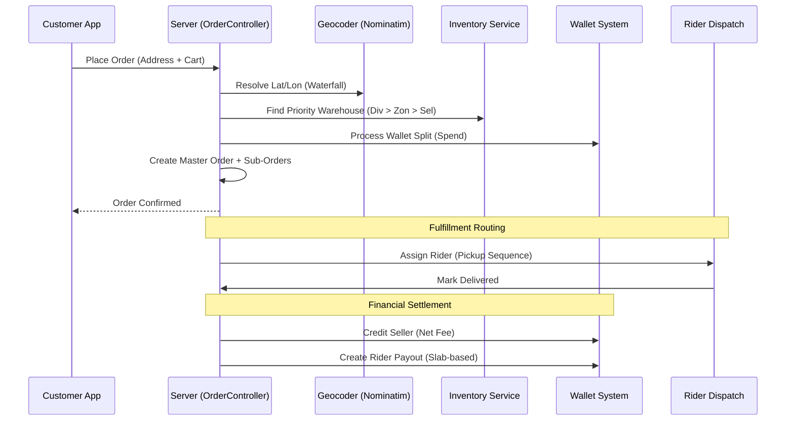

# Order Lifecycle: Technical & Financial Guide

This document provides a deep-dive into the Big Bast Mart order lifecycle, explaining how addresses are resolved, inventory is assigned, payments are processed, and payouts are calculated.

---

## 1. Phase 1: Address & Geocoding

The system ensures that every order has accurate GPS coordinates for delivery, which are essential for rider routing and distance-based payouts.

### 1.1 Address Resolution
- **Input**: The client sends a flat address string or a structured object (House #, Street, etc.).
- **Concatenation**: In `orderController.js`, structured fields are joined into a single `addressString`.

### 1.2 Geocoding Waterfall
The system uses `utils/geocode.js` to resolve coordinates. It employs a **Waterfall Strategy** to maximize reliability while adhering to rate limits:
1.  **Nominatim (OpenStreetMap)**: The primary provider.
2.  **Photon (Komoot)**: The fallback provider if Nominatim fails or returns no results.

> [!TIP]
> To save time during checkout, the system tries to geocode synchronously with a **4-second timeout**. If it fails, the order is created without coordinates, and a background task (`setImmediate`) retries the geocoding.

### 1.3 Mobile App GPS Priority
If the mobile app provides `delivery_latitude` and `delivery_longitude` directly (using the device's high-accuracy GPS), the server **skips** geocoding and uses these coordinates as the source of truth.

---

## 2. Phase 2: Inventory & Warehouse Selection

BBM uses a **Priority-Based Inventory Routing** system to fulfill orders from the most efficient source.

### 2.1 The Priority Rule
For every item in the cart, the system checks for stock in this specific order:
1.  **Division Warehouse** (City-level dark stores)
2.  **Zonal Warehouse** (Local dark stores)
3.  **Seller Store** (Validated seller partner)

### 2.2 Selection Logic
- The system filters warehouses that are `is_active = true` and mapped to the customer's **Pincode**.
- It calculates "Available Stock" as: `Stock Qty - Reserved Qty - Soft Reserved (Cart) Qty`.
- If an item is found in a Division warehouse, it will **never** be routed to a Seller, even if the Seller is closer.

---

## 3. Phase 3: Wallet & Financial Processing

BBM supports "Mixed Payments," allowing users to combine their wallet balance with external payment gateways (Razorpay).

### 3.1 Payment Splitting
In `checkoutService.js`, the system calculates the split:
- **Wallet Amount**: `MIN(Balance, Order Total)`.
- **External Amount**: `Order Total - Wallet Amount`.

### 3.2 Atomic Spend
When an order is placed:
- If use_wallet=true, the system calls `processWalletPayment`.
- A transaction of type `SPEND` is created.
- The balance is deducted **atomically** within a database transaction to prevent double-spending.

---

## 4. Phase 4: Fulfillment Routing (Sub-Orders)

An "Order" is split into multiple "Sub-Orders" based on their fulfillment source.

### 4.1 Routing Logic (`fulfillmentRouter.js`)
- **Zonal Source**: Dispatched to the zonal warehouse's in-house delivery team. **No rider is assigned.**
- **Division/Seller Source**: Requires a professional rider.

### 4.2 The Basket Size Rule (10+ Stops)
If a single master order requires pickups from **more than 10 different sources**, the system triggers the **Division Dispatch System**, which uses more complex routing algorithms to optimize the rider's path.

### 4.3 Pickup Sequencing
For standard rider assignments, the system orders stops to minimize time:
1.  **Sellers First**: Pick up from external partners.
2.  **Division Last**: Final pickup from the BBM warehouse before heading to the customer.

---

## 5. Phase 5: Delivery & Payouts

The final phase calculates earnings for the rider and net profit for the seller.

### 5.1 Rider Payout (Distance Slabs)
- **Distance**: Calculated as `Leg 1 (Rider to Pickup)` + `Leg 2 (Pickup to Customer)`.
- **Slab Match**: The total KM is matched against the `payout_slabs` table.
- **Locking**: As documented in the [COD Flow](file:///Users/ayushchauhan/Desktop/Big-bast-mart/backend-deployed/docs/cod_payout_flow.md), the payout is blocked if the rider has pending COD deposits.

### 5.2 Seller Earnings (Platform Fees)
- **Calculation**: `Seller Credit = Item Price - (Item Price * Platform Fee %)`.
- **Fee Resolution**: Fees are resolved dynamically based on the product's **Category, Subcategory, and Group**.

---

## Visualizing the Full Path

### Full Order Lifecycle Sequence

