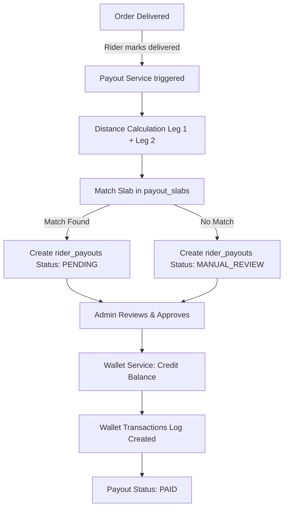
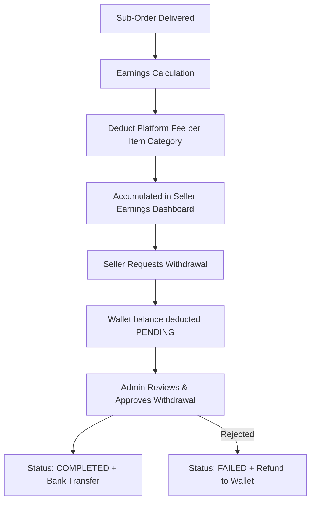
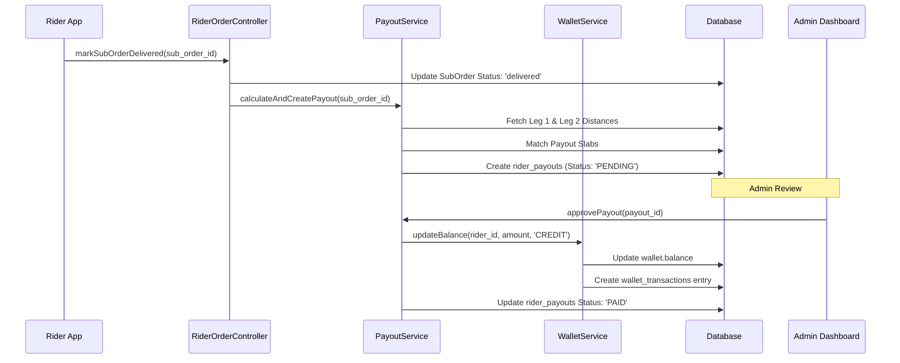

# Payout & Earnings Documentation

This document provides a technical overview of the Rider and Seller payout mechanisms within the Big Bast Mart platform, specifically focusing on the logic triggered upon order delivery.

## 1. Rider Payout System

The Rider payout system is a distance-based incentive model that calculates earnings based on the total travel distance for a sub-order.

### 1.1 Trigger Mechanism
The payout process is initiated when a rider marks a sub-order as **Delivered** in the application.

- **Controller**: `riderOrderController.js`
- **Function**: `markSubOrderDelivered`
- **Service Call**: `payoutService.calculateAndCreatePayout(subOrderId)`

> [!NOTE]
> The payout calculation is executed asynchronously using `setImmediate` to ensure that the delivery status update remains fast and non-blocking for the rider.

### 1.2 Geo-Location Calculation
The system utilizes the **Haversine Formula** to determine the shortest distance between two points on a sphere (Earth's surface).

- **Formula Implementation**: `calculateDistanceKm(lat1, lon1, lat2, lon2)`
- **Radius (R)**: `6371 km` (Mean radius of Earth)
- **Data Points**:
    - **Rider Starting Point**: Fixed at the point of order acceptance (last known GPS record from `rider_locations`).
    - **Pickup Source**: Fixed at the `latitude` and `longitude` of the assigned `warehouses` or `sellers` record.
    - **Customer Destination**: Preferred from the `delivery_latitude/longitude` captured during checkout. If GPS is unavailable, the system fallback is a lookup in the `pincode_locations` table using the order's `delivery_pincode`.

**Calculation Legs**:
- **Leg 1**: Distance from Rider position to Pick-up point.
- **Leg 2**: Distance from Pick-up point to Customer delivery point.
- **Total Km**: The sum of Leg 1 and Leg 2 (rounded to 2 decimal places).

### 1.3 Payout Decisioning
Once the total distance is calculated, the system follows these steps to decide the payout:

#### A. Automated Slab Matching
The system queries the `payout_slabs` table for a record where:
- The slab is `is_active = true`.
- The current date is within the `effective_from` and `effective_to` range.
- `min_km <= Total Distance <= max_km`.

If a match is found, the status is set to **`PENDING`** and the payout amount is locked.

#### B. Manual Review (Fallback)
If any of the following conditions are met, the payout is marked as **`MANUAL_REVIEW`**:
- No active slab matches the calculated distance.
- GPS coordinates for the rider or customer are missing, and no pincode fallback exists.
- The distance exceeds the safety threshold defined in the system.

In `MANUAL_REVIEW` mode, the payout amount remains null until an administrator manually enters the verified amount in the Admin Dashboard.
- `PENDING`: Payout calculated and awaiting admin approval.
- `MANUAL_REVIEW`: Created when the distance does not match any active slab. Requires manual amount entry by admin.
- `PAID`: Successfully credited to the rider's wallet.
- `CANCELLED`: Payout invalidated due to order cancellation or dispute.

### 1.4 Disbursement Workflow
1.  **Admin Approval**: An administrator reviews the `PENDING` payout via the Admin Dashboard.
2.  **Wallet Credit**: Upon approval (`approvePayout`), the system:
    - Identifies the rider's wallet.
    - Increments the `balance`.
    - Logs a `wallet_transactions` entry with `reference_type: 'rider_payout'`.
    - Updates the payout record to `PAID`.

---

## 2. Seller Earnings System

Seller earnings are derived from the product sales minus the platform's commission (Platform Fees).

### 2.1 Earnings Calculation
Earnings are calculated per sub-order item.

**Formula**: `Seller Earnings = Item Price - Platform Fee`

- **Item Price**: The `seller_offer_price` or `admin_selling_price` at the time of order placement.
- **Platform Fee**: A percentage-based fee resolved dynamically via `platformFeeService.js` based on:
    - Category
    - Subcategory
    - Product Group

### 2.2 Financial Flow
Seller financial management relies on the internal **Wallet** system.

- **Visibility**: Sellers view accumulated earnings on their dashboard via `SellerDAO.getEarnings`.
- **Withdrawal Request**: Sellers can request a payout of their balance.
    - **Controller**: `sellerController.js`
    - **Action**: `requestWalletWithdrawal`
    - **Effect**: The requested amount is immediately deducted from the wallet balance and marked as `PENDING` in `wallet_transactions`.

### 2.3 Admin Settlement
1.  Admins review withdrawal requests in the `AdminSellerController`.
2.  Upon approval, the external bank transfer is initiated (typically via Razorpay Payouts or manual bank transfer).
3.  The transaction status is updated to `COMPLETED`.

---

## 3. Data Models & Database Schema

### 3.1 Relevant Prisma Models
- `sub_orders`: The unit of delivery and payout trigger.
- `rider_payouts`: Stores distance calculations and payout status.
- `payout_slabs`: Configuration for distance-based pricing.
- `wallets`: The ledger for rider and seller balances.
- `wallet_transactions`: Audit trail for all financial movements.

### 3.2 Transaction Reference Types
| Reference Type | Description |
| :--- | :--- |
| `rider_payout` | Credit to rider for completed delivery. |
| `WITHDRAWAL` | Debit from wallet for bank transfer request. |
| `ORDER_PAYMENT` | Debit from user wallet for purchasing an order. |
| `REFUND` | Credit to user wallet for cancelled items. |

---

## 4. Wallet Credit Lifecycle Flows

### 4.1 Rider Wallet Credit Flow

The following flow describes how a rider's effort is translated into a wallet balance.

**Steps:**
1.  **Event**: Rider marks order as 'Delivered' via the mobile/rider app.
2.  **Audit**: A `rider_payouts` entry is generated. This serves as the source of truth for the session distance and expected pay.
3.  **Human-in-the-loop**: For security, an admin must verify the distance and amount in the Admin Panel.
4.  **Finalization**: Approval triggers the `updateBalance` logic, increasing the rider's `wallets` entry and creating an immutable ledger record in `wallet_transactions`.

### 4.2 Seller Earnings & Wallet Flow

The seller's financial lifecycle focuses on net earnings and the withdrawal process.

**Steps:**
1.  **Event**: Sub-order is fulfilled. Net earnings are calculated as `Price - Fee`.
2.  **Aggregation**: Earnings are aggregated in the `Seller Earnings` view via `SellerDAO.getEarnings`.
3.  **Withdrawal**: Unlike riders who have automated payouts triggered by admin, sellers initiate their own payouts via **Withdrawal Requests**.
4.  **Verification**: Admin verifies the bank details and order validity before finalizing the bank transfer.

---

## 5. Sequence Diagram

